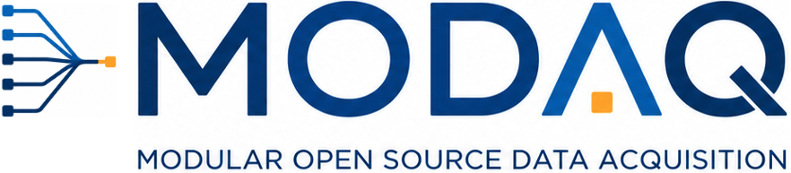

# MODAQ 2 Reference Design

!!! note
    These documents are still under development. Please contact the open-water testing support team at NLR for more information. <a href="https://www.nlr.gov/water/modaq" target="_blank">Contact Us</a>

The National Laboratory of the Rockies' (NLR) first generation <a href="https://natlabrockies.github.io/MODAQ/" target="_blank">MODAQ</a> (Modular Open-source Data AcQuisition) is a highly performant, capable, and extensible platform for data acquisition, control, and automation that is based on the National Instruments cRIO controller line and family of expansion chassis and I/O modules. While MODAQ v1.0 (M1, hereafter) has proven itself both in the field and laboratory, several factors have indicated the need for additional solutions that were not well served on the M1 architecture, which led to the development of MODAQ 2 (M2). M2 is an approach based on generally available hardware and open-source development tools. 

## Motivation

Before diving too deeply into the details, it's important to understand the motivation behind M2. There were several drivers, but they all boil down to either: 

1. We did not have a solution that satisfied particular project requirements, or
2. Feedback from customers and partners 

In the case of #1, projects may have power or physical limitations that simply could not be met with any cRIO-based M1 variant. What was often the case is that we needed a solution that could be powered by batteries or otherwise have low power consumption. While our go-to cRIO (<a href="https://www.ni.com/en-us/shop/model/crio-9049.html" target="_blank">9049</a>) in M1 is relatively power efficient (60W at maximum load), it's not practical for battery or power constrained applications. And despite its compactness, it can be too big (and heavy) for some use cases. Further, a cRIO was often overkill for some applications. While the cRIO scales up nicely, it does not scale well in the other direction. 

With regards to feedback from the companies and organizations we frequently work with, there's often resistance to the M1 platform based on system cost or universality of the software development language- or both. 

National Instruments publishes the price of its hardware on their website, so it's easy to get an idea of the price range for the controller and I/O modules. With strained budgets and an eye toward the future, where an organization may be considering arrays of devices or multiple device variants, it can be questionable if the M1 platform is a good fit, particularly when considering a pivot to commercialization. 

Then there's the concern about the development language. M1 is written in LabVIEW, which is National Instruments' proprietary programming language. Here the issues are mostly around subscription costs and availability of LabVIEW developers. There's no sugar-coating that annual <a href="https://www.ni.com/en/shop/labview/select-edition.html" target="_blank">subscription costs</a> for a LabVIEW Professional seat can be eye-opening- especially after bundling the Real-Time and FPGA modules. 

Aside from the cost, availability of skilled LabVIEW developers pales in comparison to that of languages such as Python or C/C++. LabVIEW does not even appear in popular <a href="https://survey.stackoverflow.co/2023/#section-most-popular-technologies-programming-scripting-and-markup-languages" target="_blank">development language rankings</a>. While it might not be fair to compare LabVIEW to general-purpose languages - and it's probably fairer to compare it to industrial programming languages such as those used for PLC or other vendor-specific packages - the fact remains that LabVIEW is rather niche and organizations with small teams find it challenging to find suitable engineering candidates that just happen to be competent in LabVIEW in the job market. 

The intent here is not to bash on NI or LabVIEW, but rather to point out some of the challenges involved when collaborating with commercial enterprises- and even academia to some degree. We use NI and LabVIEW extensively at NLR and appreciate how they enable rapid development of data acquisition and control systems, complete with graphical user interfaces, for test setups. Some of us have experience in this ecosystem dating back to the 1900's! 

## M2 Goals and Design Requirements

There is little point to developing a new system without first establishing some overarching goals. Much of this can be gleaned from the previous motivation section, but here we explicitly state the goals we're trying to achieve with M2. 

The primary goals of MODAQ 2 are to:

- Develop hardware and software architectures that can adapt to a wide range of missions and use-cases
- Assure measurement performance and quality parity with M1
- Utilize a development stack based on popular programming languages and tools
- Avoid vendor lock-in and single-source solutions

... and some Design Requirements:

- Modularity in both the design of the hardware and software
- Support a range of controller options and I/O types
- Ruggedized durability and 24/7 performance  
- Precision time keeping and synchronization
- Real-time, deterministic performance
- Support for common communications protocols 
- Configuration through a text-based file or utility
- Supervisory and automation control capability
- HMI and web-based data dashboard
- Built-in AWS S3 and SMTP support

