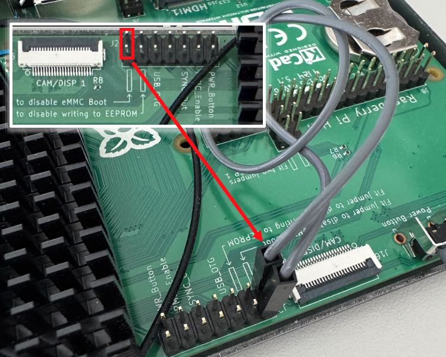

# M2 Software 
This section will discuss the software architecture of the M2 and explain the reference design available on the NLR GitHub at <a href="https://github.com/NatLabRockies/MODAQ2" target="_blank">MODAQ2</a>. For discussion on design decisions and details on technical aspects of the software design, please see the Technical Reference page.

### Introduction
M2 has been designed around the ROS2 ecosystem of libraries and tools to provide users a well established way of developing a data acquisition system. ROS2 was selected because it is easy to learn with many free online training resources, completely free and open-source, supports multiple programming languages, and is reliable for long term use in industrial settings. There is also a plethora of already existing ROS packages that users can leverage in addition to the packages developed in the MODAQ 2 project.

The MODAQ 2 project is the amalgamation of ROS packages, tools, and guidance for developing data acquisition and control applications for marine energy devices using a ROS based architecture. The MODAQ 2 Reference Design includes several packages that are targeted for laboratory and field applications and allow most developers with a basic background in programming to spin up a high-quality DAQ and control system.

The main software aspects of MODAQ 2 are as follows:

- Ubuntu Linux Operating System
- RO2 Humble Hawksbill (or Jazzy Jalisco for Arm64)
- Externally Developed ROS Packages
- MODAQ 2 Custom and Internally Developed ROS Packages
- Third Party DAQ Driver libraries

## Ubuntu Operating System
Ubuntu is a free to use (for most applications) Linux distribution and has the best support for the ROS ecosystem. To get started working in Ubuntu, it is recommended to visit the [Hardware page](hardware.md) of this document to ensure that your controller meets the requirements of the MODAQ 2 design. After that, you can follow the instructions provided in [Useful Links](links.md#ubuntu) to install the correct version of Ubuntu Desktop on your controller. At the present time, select Ubuntu 22.04 Desktop for x86_64 (Intel and AMD64) controllers and Ubuntu 24.04 for Arm64. 

!!! note
    Ubuntu 24.04 <a href="https://forums.raspberrypi.com/viewtopic.php?t=359566#p2157713" target="_blank">officially supports</a> the Raspberry Pi CM5 hardware. Since ROS2 released tend to be tied to specific Ubuntu versions, Arm64 applications will need to use ROS2 Jazzy instead of Humble. 

    M2 was originally written for x86_64 controllers with Ubuntu 22.04 and ROS2 Humble. We have yet to validate 24.04 with ROS2 Jazzy on x86_64. Regardless, installation and setup instructions are the same, with the exception of selecting the appropriate installers.   

### Installing Ubuntu 22.04 on x86_64 Controllers
The easiest way to install Ubuntu on a x86_64 controller is to <a href="https://ubuntu.com/desktop/docs/en/latest/how-to/create-a-bootable-usb-stick/#create-a-bootable-usb-stick" target="_blank">create the installer on a USB stick</a>. 

1. Download either the Desktop or Server install image <a href="https://releases.ubuntu.com/jammy/" target="_blank">here</a>.

    !!! question "Ubuntu Desktop or Server?"
        Either Ubuntu Desktop or Server edition can be used with M2. 

        **Choose Desktop if:** you might want to connect a keyboard, mouse, and monitor the controller and rather work in a graphical desktop environment. This option will install a number of apps that may or may not be useful, such as LibreOffice. This will consume more space on your OS install target and require at least 4GB of RAM.

        **Choose Server if:** you are comfortable working in the command line interface (AKA terminal/console). While this a bit more complex, the command line is used extensively with M2 and ROS2, so there's no avoiding it. Desktop features can be installed in Server if so desired.

2. Install a USB writer utility, such as <a href="https://etcher.balena.io/" target="_blank">BalenaEtcher</a>, which is available for Windows, Linux, and MacOS hosts. (NOTE: Ubuntu has a creation tool built in:  Startup Disk Creator. So you can skip this step)
3. Burn/etch the Ubuntu 22.04 file downloaded in Step 1 to a blank USB stick.
4. Place the newly etched USB stick in a USB port on the controller target and boot from the stick. 

    !!! note
        Most x86_84 based controllers should be set to automatically boot from USB media, however if this does not happen, it may be necessary to go into BIOS and change the boot order so that the USB ports are prioritized. This process varies from manufacturer to manufacturer, so consult documentation for your controller if unsure how to do this.

5. Follow onscreen instructions to install the OS to the desired location on the controller. 

### Installing Ubuntu 24.04 on Arm64 Controllers
There are a couple methods of installing an OS to a CM5, which to chose will depend on the version of the CM5 you have and where you want the OS to be installed. We chose CM5s with onboard eMMC storage and installed the OS there. We could have opted to install the OS to the NVMe SSD drive, however we prefer to use the SSD for data only. If the OS and data reside on the same drive, it's more involved to swap the drive (for instance, it might be desirable to quickly replace a full drive with an empty one in the field), since the OS will need to be cloned to the new drive. Lite variants of the CM5 (those without eMMC) could have the OS installed to a microSD card.

Download the Ubuntu 24.04 Desktop install image <a href="https://cdimage.ubuntu.com/releases/noble/release/ubuntu-24.04.4-preinstalled-desktop-arm64+raspi.img.xz">here</a> or Server image <a href="https://cdimage.ubuntu.com/releases/noble/release/ubuntu-24.04.4-preinstalled-server-arm64+raspi.img.xz">here</a>.

!!! question "Ubuntu Desktop or Server?"
    Either Ubuntu Desktop or Server edition can be used with M2. 

    **Choose Desktop if:** you might want to connect a keyboard, mouse, and monitor the controller and rather work in a graphical desktop environment. This option will install a number of apps that may or may not be useful, such as LibreOffice. This will consume more space on your OS install target and require at least 4GB of RAM.

    **Choose Server if:** you are comfortable working in the command line interface (AKA terminal/console). While this a bit more complex, the command line is used extensively with M2 and ROS2, so there's no avoiding it. Desktop features can be installed in Server if so desired.

#### Install the Raspberry Pi Imager on the Host Computer
Following the installation instructions found <a href="https://www.raspberrypi.com/documentation/computers/getting-started.html#step-1-install-and-launch-imager" target="_blank">here</a>.

#### CM5 Lite Ubuntu Install on microSD Card
It's recommended to follow the instructions in the official <a href="https://www.raspberrypi.com/documentation/computers/getting-started.html#install" target="_blank">Raspberry Pi Documentation</a>. In Step 2, do one of the following (not both!):

1. Download the image Ubuntu 24.04 install image from the link above. Scroll down to "Use custom" in the Raspberry Pi Imager software. In the file dialog that pops up, select the image you downloaded.
2. Scroll down to "Other general-purpose OS" in the Raspberry Pi Imager software. On the next screen, select Ubuntu, then Ubuntu Desktop 24.04.4 LTS (64-bit). The imager software will download the OS.

The final step is to select the destination for the software to write the OS image, per the documentation.

#### CM5 Ubuntu Install to eMMC or SSD drive
This is a bit more involved and borderline hacky, but this is how it's done!

1. Download the desired Ubuntu 24.04 image per links above (optionally, the image can be selected and downloaded in the Raspberry Pi Imager software during Step 8). 
2. Install the USB Boot utility on your host computer per the instructions found <a href="https://www.raspberrypi.com/documentation/computers/compute-module.html#set-up-the-host-device" target="_blank">here</a>.
3. Place the CM5 in USB Boot Mode. If using the OEM CM5 carrier board, this is accomplished by jumpering 2 pins on the carrier board:

If using a 3rd party carrier board, consult the instructions for that board to place the CM5 in USB Boot Mode.
4. Connect the USB-C connector on the carrier board to your host computer
5. Make sure rpiboot that was installed in Step 2 is running. The CM5 should now be mounted.
6. Launch the Raspberry Pi Imager software
7. In the Imager software, select RASPBERRY PI 5 as the **Raspberry Pi Device**.
8. Under **Operating System**, do one of the following (not both!):
    1. Download the Ubuntu 24.04 install image from the link above. Scroll down to "Use custom". In the file dialog that pops up, select the image you downloaded.
    2. Scroll down to "Other general-purpose OS". On the next screen, select Ubuntu, then Ubuntu Desktop (or Server) 24.04.4 LTS (64-bit). The imager software will download the OS. (NOTE: It's possible that a later version of Ubuntu 24.04 LTS will appear in the Imager options. This is okay, simply select the latest version that starts with 24.04)
9. Under **Storage**, find the CM5 target where the OS is to be installed (either the eMMC or NVMe SSD). 
    1. eMMC - There should be an option with wording similar to this: "mmcblk0 Raspberry Pi multi-function USB device". The important part is the "mmcblk0", where "mmc" is the eMMC. 
    2. NVMe SSD - There should be an option with wording similar to this: "nvme0n1 Raspberry Pi multi-function USB device". The important part is the "nvme0n1", where "nvme" is the NVMe SSD. 
10. Proceed to flash the OS to the selected target. **WARNING:** this step will erase the target. Make sure the target is either blank or contains nothing of value since it will be deleted.
11. Remove the jumper installed in Step 3 and apply power to the carrier board. The CM5 should now boot into Ubuntu.


## Why ROS2?

The Robotic Operating System (ROS) is a collection of middleware, libraries and tools that were designed to benefit the robotics development community. The qualities of ROS that benefit the robotics community also benefit the data acquisition and control for marine energy community. It provides an easy entry point for software development for data acquisition control but it also is very scalable and has the capabilities to do very advanced computational tasks if needed for a project. For example, after installing ROS2 and MODAQ 2 packages, you can quickly run a process that collects and logs sensor data in mcap bag files for data analysis. However, if you need to build code that is deterministic or real-time, this is also possible with ROS but requires a much lower level understanding of computer programming and is likely not necessary for many applications. In summary, ROS is adaptable and extensible to meet the requirements of a data acquisition and control project.

!!! note
    Unless otherwise noted, wherever we say ROS, we mean ROS2. There are <a href="https://roboticsbackend.com/ros1-vs-ros2-practical-overview/" target="_blank">significant differences between ROS1 and ROS2</a> and they are not directly compatible. Use caution when searching for ROS online, a lot of links often go to ROS1 resources. 

The fundamentals of ROS are covered extensively in many online trainings, videos, whitepapers and classes, and we have collected our recommended starting places in the [Useful Links](links.md#ubuntu) page.

For MODAQ 2 usage, the main concepts to understand are as follows:

- Nodes: the software processes that make up a ROS system
- Packages: collections of nodes usually including all the necessary nodes to use a system component
- Topics, Messages, Publishers and Subscribers: how ROS nodes communicate with each other
- Middleware DDS: the background system that allows nodes to communicate reliably and with modularity
- Command Line Tools: useful tools to test and debug ROS systems
- Build System: colcon is used to build ROS2 packages
- Launch Files: files that define the startup and execution of a complete ROS system
- Parameters: configuration items that can modify how the ROS system operates
- Bag (mcap) files: data files that database the information collected and communicated through ROS


### Install ROS2

It is recommended to follow the step-by-step process available from ros.org to properly install ROS2 on the linux controller target. 

For x86_64, AMD64 targets using Ubuntu 22.04.x, install <a href="https://docs.ros.org/en/humble/Installation/Ubuntu-Install-Debs.html" target="_blank">Humble Hawksbill</a>.

For ARM64 targets using Ubuntu 24.04.x, install <a href="https://docs.ros.org/en/jazzy/Installation/Ubuntu-Install-Debs.html" target="_blank">Jazzy Jalisco</a>.


The hardware requirements should be met before continuing with setting up the software requirements.

```
## Please follow the provided instructions for installing ROS2 but you can verify the install with this command:
sudo apt update
sudo apt upgrade
sudo apt install ros-humble-desktop ros-dev-tools ros-humble-rosbag2 ros-humble-rosbag2-storage-mcap nginx git curl linuxptp ros-humble-rosbridge-suite
```
This command will verify the proper installation of the main components of ROS on your Ubuntu 22.04 controller. This doesn't include the [Labjack LJM Library](software.md#labjack-ljm-library) which is required for using the Labjack T8 device. Instructions for installing this are described below.

## Cloning the Repo
Follow the instructions described in [M2 Github](github.md).

## M2 Launch
The m2_launch package includes the python launch file which starts all the parallel processes (nodes) of the MODAQ 2 system. In m2_launch.py, the nodes of the system are specified and the config file is supplied. All ROS parameters of a node should be specified in the config file.


!!! note
    The name of the node specified in the launch file must match the name of the node in the yaml config file. I.e. M2Supervisor in the launch file and the config yaml file.

### Example launch and config files:
```py
import yaml
import os
from launch import LaunchDescription
from launch_ros.actions import  Node
from launch_ros.actions.node import ExecuteProcess
from datetime import datetime
from ament_index_python.packages import get_package_share_directory

#### PATH TO MODAQ CONFIG FILE ######
## FYI THIS PULLS THE FILE FROM THE INSTALL DIRECTORY, NOT THE SRC DIRECTORY
config = os.path.join(
      get_package_share_directory('m2_launch'),
      'config',
      'm2_config.yaml'
      )

def generate_launch_description():

  return LaunchDescription([
    Node(
    package    = "m2_supervisor",
    executable = "m2_supervisor_node",
    name = "M2Supervisor",
    parameters = [config],
    output="screen",
    respawn = True
    ),
    Node(...other nodes)
  )]

```
```yaml
M2Supervisor:
  ros__parameters:
    loggerPath: "/home/m2/Log"
    loggerLimitBytes: 1000000
    emailSendAddr: "youremailwithsmtpenabled@email.com"
    emailSendPwd: "passwordhere"
    emailGroup1:
      - "youremail@email.com"      
    emailGroup2:
      - "youremail2@email.com"
    analyzedTopics:
      - /ain_flap
      - /T8din
    topicErrorEmailSnooze: 60
```

The launch file and config files are moved once the build process is completed. To access these files, you must run `source install/setup.bash` in terminal. You should then be able to launch the file with the command `ros2 launch m2_launch m2_launch.py`. Executing this will start all the ROS nodes together. If this fails, errors will be reported in the terminal to assist you with troubleshooting.


## MCAP Bag Data Files
The data collected by different nodes within MODAQ 2 is published on specific topics. This enables the data to be recorded and saved for future use. This is implemented by using the ROS2 bag recorder node and the mcap storage method. The ROS2 bag package can be installed by running `sudo apt install ros-humble-rosbag2 ros-humble-rosbag2-storage-mcap` in terminal. This is a useful tool for debugging robotic applications however, it is designed with enough reliability to function as a robust data recorder for data acquisition applications. The bag_recorded package in the MODAQ 2 reference design takes the rosbag2 API and adds some flexibility to it to allow for recording only specified topics as well as the ability to start and stop the recording programmatically.

### Configuration
The bag_recorder_node is configured in the launch file configuration yaml file and includes the folder in which to save the bag files (mcap files). It includes the length of the files in seconds. It is best to break up the mcap files so they don't become too large and to reduce to possibility of corruption if the system crashes or power is lost. It also includes the logged topics. All topics in this list will be included in the bag files. You can also enable recording all topics by specifying "*" as the logged topics.

```yaml
BagRecorder:
  ros__parameters:
    dataFolder: "/home/m2/Data"
    fileDuration: 60
    loggedTopics:
      - /system_messenger
      - /ain
      - /do
      - /T8din
```

### Parsing mcap files
The mcap file format was designed by Foxglove  and they also developed a GUI software that is able to process these data files and output plots, tables and other useful visualizers. For information on this GUI viewer, please see [Useful Links](links.md#ubuntu).

To analyze the data, we recommend using the rosbags python package which is also able to parse the mcap files and generate numpy arrays which can be used for data analysis. This can be install with pip: `pip install rosbags`

Example Python code for parsing mcap files:
```py
from rosbags.rosbag2 import Reader
from rosbags.serde import deserialize_cdr
import numpy as np
from matplotlib import pyplot as plt
from pathlib import Path
from rosbags.typesys import Stores, get_types_from_msg, get_typestore

import os

def get_all_file_names(folder_path):
    try:
        # List all files in the given folder
        file_names = os.listdir(folder_path)
        # Filter out directories, only keep files and return their full paths
        file_paths = [os.path.join(folder_path, file) for file in file_names if os.path.isfile(os.path.join(folder_path, file))]
        
        # Generate the modaq_messages/msg/{FILE_NAME} strings
        modaq_messages = [f"modaq_messages/msg/{os.path.splitext(file)[0]}" for file in file_names if os.path.isfile(os.path.join(folder_path, file))]        
        return file_paths, modaq_messages
    except Exception as e:
        print(f"An error occurred: {e}")
        return [], []


# Example usage
folder_path = r"C:\MODAQ\MODAQ2-RD-Dev\src\modaq_messages\msg"
file_names, message_types = get_all_file_names(folder_path)
print(file_names, message_types)
typestore = get_typestore(Stores.ROS2_HUMBLE)
add_types = {}

for i, name in enumerate(file_names):
    print("name: ", name)
    msgpath = Path(name)
    msgdef = msgpath.read_text(encoding='utf-8')
    print(msgdef)
    add_types.update(get_types_from_msg(msgdef, message_types[i]))

typestore.register(add_types)
# create reader instance and open for reading
last_time = 0
last_timer = 0
dt_ros = []
dt = []

with Reader(r"./") as reader:
    # Topic and msgtype information is available on .connections list.
    for connection in reader.connections:
        print(connection.topic, connection.msgtype)

    # Iterate over messages.

    for connection, timestamp, rawdata in reader.messages():
        if connection.topic == '/ain_flap':
            msg = typestore.deserialize_cdr(rawdata, connection.msgtype)
            time = (msg.header.stamp.sec + (msg.header.stamp.nanosec/1e9))
            
            dt_ros.append(time-last_time)
            last_time = time
            

            
plt.plot(np.array(dt_ros)[100::])
plt.show()
```

## MODAQ Messages
modaq_messages are custom messages that are used in MODAQ 2. ROS includes many message types by default but it was deemed necessary to build our own custom message types more applicable to our application of data acquisition. This ROS package has no nodes in it but it includes the CMake commands to turn the msg files into headers which can be referenced in different nodes. For example, /system_messenger uses modaq_messages/msg/systemmsg.hpp to define the type in different nodes. To use these custom messages, they must be included in the package.xml and the CMakeLists.txt file.

CMakeLists.txt:
```cmake
find_packages(modaq_messages REQUIRED)
ament_target_dependencies(m2_supervisor_node rclcpp std_msgs modaq_messages rosbag2_cpp)
```
package.xml:
```xml
<depend>modaq_messages</depends>
```

## M2 Supervisor
The m2_supervisor is a package that was put in place to serve as the central process of MODAQ that enables some features that are very valuable to the marine energy industry. It includes features for logging events, sending emails and monitoring the health of the bag files being recorded.

### Logger
The logger processes /system_messenger messages that have the log switch turned on and stores the information into a human-readable text file for diagnostics during operations.

### Emailer
The emailer processes /system_messenger messages that have the email switch turned on and sends and email with smtp which contains the important information in a human readable format. For this to work, you must have an email with smtp enabled - this is possible with a free gmail account.

### BagAnalyzer
Coming soon!
This feature is still under development. The goal is to develop a process that monitors bag recording to ensure that all topics are being recorded as expected.

## Labjack T8 ROS Package
The labjack_t8_ros2 package was developed specifically for use in MODAQ 2. This packages relies on a third party driver to interface with the Labjack T8.

### Labjack LJM Library
MODAQ 2 Reference Design includes the Labjack T8 to make high-speed measurements up to 40 kHz. We have provided the labjack_t8_ros2 package to connected to T8 devices and stream data to ROS so it can be acted upon with control rules and/or logged for post-processing and analysis. To use the labjack_t8_ros2 package, the Labjack LJM library needs to be installed on your controller.

The instructions for installing this library are in {MODAQ 2 Repo}/src/labjack_t8_ros2/README.md

## M2 Control
Currently the m2_control package just handles the interactions between the system and the HMI. The ROS2 ecosystem is well suited for more advanced control operations. A simple control alorithm could be implemented by creating a subsriber for the control rule input (i.e. the measurement of a battery voltage) with a callback class function. In the callback function, you could implement your algorithm (i.e. if voltage is too low, turn off a pump). The control could be actuated by then publishing a command to a digital output to turn something on or off (i.e. turning off the pump).

ROS2 also has built in control algorithms that you may find useful despite their main focus being on robot control. See the package <a href="https://control.ros.org/humble/doc/getting_started/getting_started.html" target="_blank">ros2_control</a> to learn about the advanced control options developed for use in ROS2.

## Human-machine Interface
The HMI is described on the [HMI page](hmi.md)

## Headless Operation
MODAQ 2 will often need to run headless or automatically start on the boot of the controller. This can be done with linux services.

Instructions for putting this in place can be found in {MODAQ 2 Repo}/service/README.md

## Doxygen
The development of c++ documentation has started and is a work in progress. To view the c++ documentation made using doxygen, navigate to the docs folder and build using the bash command `doxygen`. More information is available in docs/README.md.
Once built, the doxygen documentation can be viewed on the nginx webserver by opening {M2_Controller_IP}/index.html

## Precision Time Protocol
The precision time protocol or IEEE1588v2 or PTPv2 is a protocol used for synchronizing clocks on a network. While this can be done at the software level on the linux kernel, it is recommended to use a hardware implementation for synchronization in the microseconds. To do this, the network interface card (NIC) of your controller must officially support PTP. This can be determined with the model number of the NIC which can be determined with the command `lspci | grep Ethernet` which returns:
```bash
01:00.0 Ethernet controller: Intel Corporation I210 Gigabit Network Connection (rev 03)
03:00.0 Ethernet controller: Intel Corporation Ethernet Controller (2) I225-IT (rev 03)
```
Both of these Intel ethernet NICs (I210 and I225) support PTP. We recommend purchasing controllers with Intel NICs as they have the highest reliability when using PTP.

The linux support for PTP can be installed using `sudo apt install linuxptp`. This enables the ptp4l tool which allows user interaction with the PTP hardware clocks on your controller's NIC.


</p>


